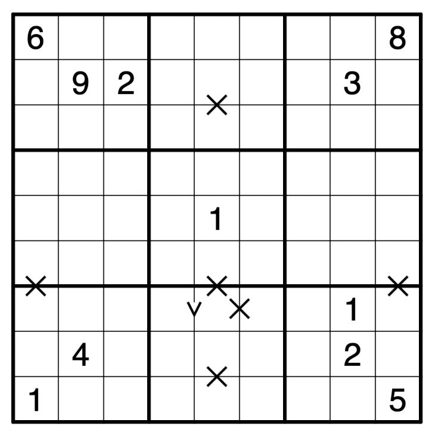
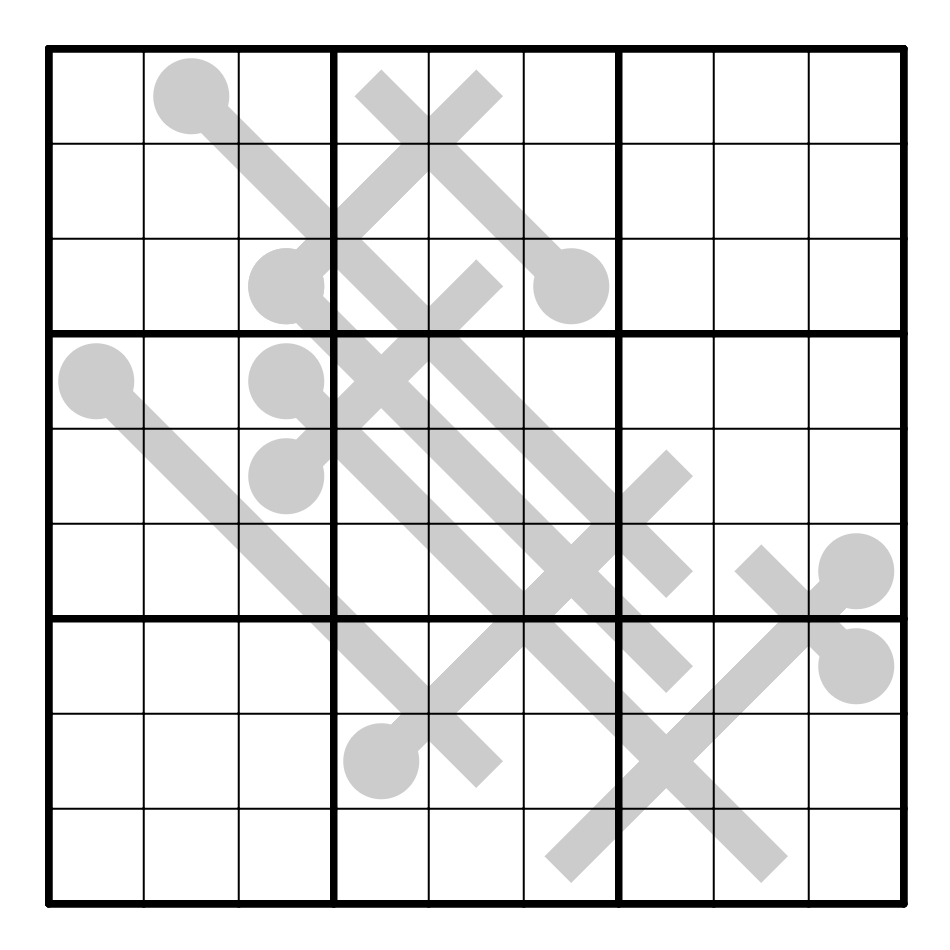

<base href="./sudoku/">

## Sudoku

## Rules

* Sudoku rules apply (insert the numbers \`1-9\` so they appear exactly once in each row, column, and bolded \`3x3\` square).
* Digits connected by a \`V\` should add to \`5\`.
* Digits connected by an \`X\` should add to \`10\`.
* Two instances of the same digit cannot be a chess knight's move away from each other.

Puzzle proposed by Rebecca Chang.

Source: [UMA November 2022](http://uma.mit.edu/puzzle)

***

Let's write a sudoku assistant for this puzzle!

[sudoku assistant](./solver.html)

## 2023 Updates

I set a thermo! [Penpa Link](https://gmpuzzles.com/penpa-edit/#m=solve&p=zVVdb5tKEH33r7ja53lgd2HZ5S1Nm76kSXqbKooQirDjJFawSTFuIqzkt+fshxuw3dvqqle6AobD2eHM7C4zLFfX9f2KDA6pKSKOQ+rIXTq2ZxSO81lbTbO/6GDV3tUNANHp0RHdlNVyOsqDVzHKGWfEBC7Oihfm9dlLziQjU4zW3d/ZurvK8uKZuq9vUL/BL9ka9sRZ7uyls0fOCmfPszxPFKUuSaOJc1FQ/g8nFwJOkfXVCs/KkJZkUpCYskiIS7P7ljAUS0pSSjnphIx14RFe4DK8lPbdVUqakwEfGYxLUFrYJBMNiHzjmKRNNIFuQpJbOR7DPSoK6iTmT917ZyNnE2eP3ZQ/ZGvGtSJuDMsEltcYElw4jDsJkXiMvITUHmNPRcI9TjgJFXusYhJp6nGakjCRxwY7H0mvr6EfBf0I+jzoc+iLoC+gHwf9GPpJ0E+gr4I+VkXooI+vShivjztiqaBj8w+8kMBBR0CnPy+x8VfAQV9Av5+P8OuDO9YhxJWIK0Oeyq5DmJdCXBXiKsTtr48KcRXiqhBXIW5/XirEVYirQlx8WiK1cbFpF27rDp2NnVVuS1P7qY9GOfK1Fdc/8PX8nxhUNKqWLevqarlqbsrJlGWu5slxi9V8PG1Y1jarwFR1/VDNFkO32e2ibqZ7hyw5vb7d5z+um2sr3ht4LKtqQCy/rcpm+PJk1kyqIdU2s8Fz2TT144CZl+3dgBiXLRre8m72MFSaLtphAm05TLG8L7eizd/m/DxiT8xduUTDlLYjmqw7oO5jNmid1H1GS/yUdWe2I+aMYStsK3BO6CHoBz/ghRu36NCTPAI+CRjwEtCvytWxZ86yvDsnZuO8c29byOb1dyTq87DPk3o+xlRy1lsMPxL6+iYEPuwDl+5mYE/SaIebpC30SVu0J2k7l/8yafczevabEf3Bn1J3Sv/2/J0fwC87ylMo1brZW62gNwU7ZPdWZuB3ihP8ThnagLuVCHZPMYLdrkdQuyUJcqcqwf2kMK3qdm3arLbL04baqVAbql+keTF6BQ==&a=RZJRqgQxCATvst9+TNREc5bH3v8aO+kKPBhoQspuNfP397X/7zOex/Jjrw5z6bKS1j23bem2dXRcfgybUreWhoU0bUg36g+cDzh3OA98Pcnxib/ffC9ywq9e/0i4mPjFIieKumj8YuOf5HurzOkqHsExxLwRx+pNOElvwCl4/Y/Pa39ik2kTMiEz5ZKQeclSQpKXdDFTd3NyWiqYJc8JOelssd7FtpYrYfEWC3JBFmQNIeWyLrZUzFDsqB/d9VBB8wAd8mzIviTLb2Zo8nbobjPtnirYrH2XzPYlz7Tnx/r+AA==).

Rules: Standard [Thermo-Sudoku](https://www.gmpuzzles.com/blog/thermo-sudoku-rules-and-info/) rules.

